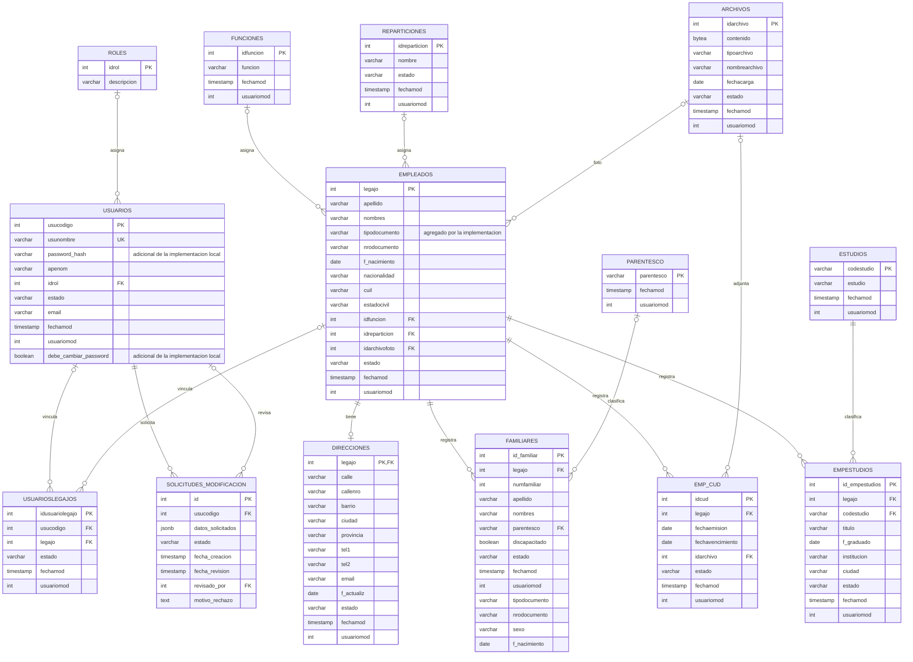

# Diagrama entidad-relación de la implementación

Este DER complementa el diagrama recibido para la práctica: representa el esquema PostgreSQL de la implementación local, incluyendo sus extensiones. No reemplaza ni modifica el diseño original entregado por la institución.

El diagrama se basa en [`bootstrap/demo-schema.sql`](./bootstrap/demo-schema.sql), que contiene estructura sin datos de personas. GitHub representa el siguiente bloque Mermaid como diagrama visual al abrir este archivo.

La comparación y explicación de las diferencias respecto del DER original están integradas en la sección **“Diferencias respecto del DER recibido”** de la [documentación funcional](../../frontend/DOCUMENTACION.md). Este diagrama refleja las claves foráneas declaradas en el esquema local de demostración; no reemplaza ni certifica el esquema institucional. Las secuencias que generan identificadores automáticamente se omiten por ser un detalle de implementación física.
